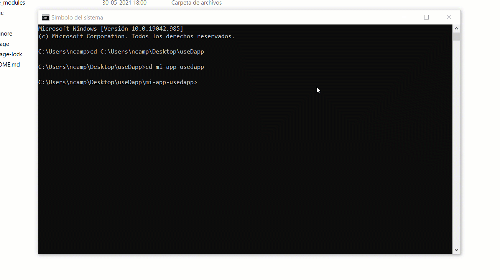

# Tutorial useDapp


## Tabla de contenidos
1. [Introducción](#introduccion)
2. [Instalación](#instalacion)
3. [Configuración](#configuracion)
4. [Conectarse a una red](#conectarse)
5. [Saldo de Ether](#ether)
6. [Saldo de tokens](#tokens)
7. [Solución de problemas](#problemas)

## Introducción <a name="introduccion"></a>

El propósito de este tutorial es entender cómo puedes crear dApps utilizando **useDapp** en React.

## Instalación <a name="instalacion"></a>

Para comenzar a trabajar con **useDapp**, debe tener un entorno React funcionando.

Luego, agrega el siguiente paquete npm *@usedapp/core* a su proyecto:

<details>
  <summary>Con NPM</summary>
  
  ```sh
  npm install @usedapp/core
  ```
</details>

<details>
  <summary>Con Yarn</summary>
  
  ```sh
  yarn add @usedapp/core
  ```
</details>



## Configuración <a name="configuracion"></a>

Lo primero que debes hacer es configurar DAppProvider con configuración opcional y envolver toda su aplicación en él. Puedes leer sobre la configuración [aquí](https://usedapp.readthedocs.io/en/latest/core.html#config).


<details>
  <summary>Ver el ejemplo</summary>
  
  ```javascript
  <DAppProvider>
    <App /> {/* Contener tu aplicación con el DAppProvider */}
  </DAppProvider>
  ```
</details>


## Conectarse a una red <a name="conectarse"></a>

Ahora, debes activar el proveedor mediante **activeBrowserWallet**. Es mejor hacerlo cuando el usuario hace clic en el botón "Conectar".

<details>
  <summary>Ver el ejemplo</summary>
  
  ```javascript
  export function App() {
    const { activateBrowserWallet, account } = useEthers()
    return (
      <div>
        <div>
          <button onClick={() => activateBrowserWallet()}>Connect</button>
        </div>
        {account && <p>Account: {account}</p>}
      </div>
    )
  }
  ```
</details>

Después de la activación (es decir, el usuario se conecta a una billetera como MetaMask), el componente mostrará la dirección del usuario.

Si necesitas usar otro conector que no sea una billetera de navegador, usa el método de activación de **useEthers**. Consulte el documento [web3-react](https://github.com/NoahZinsmeister/web3-react/tree/v6/docs#overview) para ello.

## Saldo de Ether <a name="ether"></a>

*useEtherBalance(address: string)*

Proporciona una forma de recuperar el saldo de la cuenta. Toma la dirección de la cuenta como argumento y devuelve *BigNumber* o *undefined* cuando los datos no están disponibles (es decir, no conectados). Para obtener la cuenta actualmente conectada, utiliza **useEthers()**.


<details>
  <summary>Ver el ejemplo</summary>
  
  ```javascript
  import { formatEther } from '@ethersproject/units'

  export function EtherBalance() {
    const { account } = useEthers()
    const etherBalance = useEtherBalance(account)

    return (
      <div>
        {etherBalance && <p>Balance: {formatEther(etherBalance)}</p>}
      </div>
    )
  }
  ```
</details>

## Saldo de tokens <a name="tokens"></a>

*useTokenBalance(address: string, tokenAddress: string)*

Proporciona una forma de obtener el saldo del token ERC20 especificado por *tokenAddress* para la dirección proporcionada. Devuelve *BigNumber* o *undefined* cuando los datos no están disponibles.

<details>
  <summary>Ver el ejemplo</summary>
  
  ```javascript
  import { formatUnits } from '@ethersproject/units'

  const DAI = '0x6b175474e89094c44da98b954eedeac495271d0f'

  export function TokenBalance() {
    const { account } = useEthers()
    const tokenBalance = useTokenBalance(DAI, account)

    return (
      <div>
        {tokenBalance && <p>Balance: {formatUnits(tokenBalance, 18)}</p>}
      </div>
    )
  }
  ```
</details>

## Solución de problemas <a name="problemas"></a>

### Falta de coincidencia de tipos al construir
Si al crear una aplicación ves errores sobre la falta de coincidencia de tipos en **@ethersproject**.

Por ejemplo:

<details>
  <summary>Ver el ejemplo</summary>
  
  ```console
  $ yarn build
    yarn run v1.22.10
    $ tsc --noEmit && rimraf build && webpack --mode production --progress
    src/components/Transactions/Forms.tsx:12:52 - error TS2345: Argument of type 'Interface' is not assignable to parameter of type 'ContractInterface'.
      Property 'getError' is missing in type 'import("github.com/ethworks/usedapp/packages/example/node_modules/@ethersproject/abi/lib/interface").Interface' but required in type 'import("github.com/ethworks/usedapp/packages/example/node_modules/@ethersproject/contracts/node_modules/@ethersproject/abi/lib/interface").Interface'.

    12 const contract = new Contract(wethContractAddress, wethInterface)
                                                          ~~~~~~~~~~~~~

      node_modules/@ethersproject/contracts/node_modules/@ethersproject/abi/lib/interface.d.ts:53:5
        53     getError(nameOrSignatureOrSighash: string): ErrorFragment;
              ~~~~~~~~
        'getError' is declared here.


    Found 1 error.

    error Command failed with exit code 2.
    info Visit https://yarnpkg.com/en/docs/cli/run for documentation about this command.
  ```
</details>

Puede ser un error de yarn obteniendo versiones internas de **@ethersproject** que son superiores a las especificadas en useDApp. Para solucionar este problema, debes agregar *"resolutions"* a su package.json con paquetes **etherspoject** que causan un error, con la versión correcta. Las resoluciones obligan a *Yarn* a instalar versiones específicas de paquetes.

Por ejemplo:

<details>
  <summary>Ver el ejemplo</summary>
  
  ```json
  "resolutions": {
      "@ethersproject/abi": "5.2.0",
      "@ethersproject/contracts": "5.2.0"
    }
  ```
</details>


